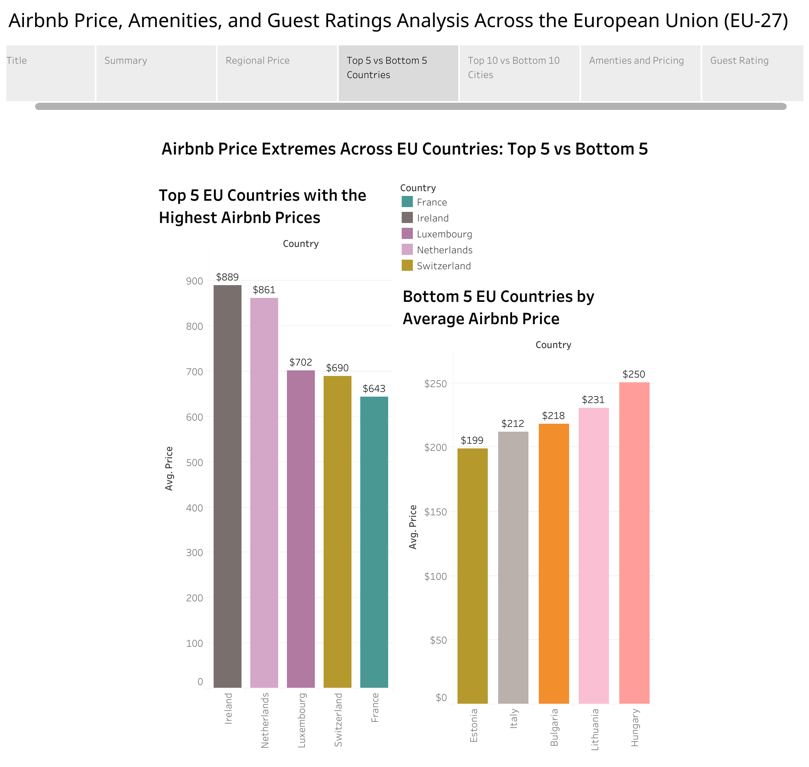

# Airbnb Price, Amenities, and Guest Ratings Analysis Across the European Union (EU-27)

## 📌 Problem Statement  
This project analyzes Airbnb listings across the **27 European Union countries** (~2,500+ listings) to explore how **price, amenities, and guest ratings** are connected. I collected the data using **Python Selenium** from Airbnb’s public pages and visualized insights using **Tableau**.  

The study investigates:  
- Regional **price variation** across EU countries and cities.  
- **Top 5 vs Bottom 5 countries** in Airbnb prices.  
- **Top 10 vs Bottom 10 cities** by average price.  
- The **impact of amenities** on Airbnb pricing.  
- How **guest ratings** (cleanliness, accuracy, communication, and value) correlate with satisfaction.  

👉 View the interactive Tableau dashboard here:  
[🔗 Airbnb EU-27 Dashboard](https://public.tableau.com/app/profile/md.amit.hasan.rakib/viz/Book1_17560994270280/Story1?publish=yes)  

---

## 🕸️ Data Scraping & Preprocessing  

To build this dataset, I scraped **2,521 Airbnb listings** from public pages across **27 EU countries** (5 cities per country) using **Python Selenium** and **ChromeDriver**.  

- **Scraping**: Automated collection of listing details such as price, ratings (cleanliness, accuracy, check-in, communication, value), and amenity categories.  
- **Preprocessing**: Cleaned and standardized the raw data with **Pandas** and **NumPy** by handling missing values, formatting inconsistencies, and organizing columns.  
- **Dataset Structure**: The final cleaned dataset retained **2,521 valid rows** with the following main features:  
  - **Location**: Country, City, Title  
  - **Pricing**: Price per night  
  - **Guest Ratings**: Cleanliness, Accuracy, Check-in, Communication, Value  
  - **Amenities**: Bathroom, Bedroom & Laundry, Entertainment, Heating & Cooling, Privacy & Safety, Internet & Office, Kitchen & Dining, Parking & Facilities, Services  

The processed dataset is stored as **`data/airbnb_eu27.csv`** and was later used for exploratory analysis and Tableau visualizations.  

## 📊 Findings and Observations  

- **Regional Prices**:  
  - Ireland, Netherlands, Luxembourg, Switzerland, and France have the **highest average Airbnb prices**.  
  - Estonia, Italy, Bulgaria, Lithuania, and Hungary have the **lowest average prices**.  

- **Top 5 vs Bottom 5 Countries**:  
  - **Top 5 (Highest Avg. Price)**: Ireland ($889), Netherlands ($861), Luxembourg ($702), Switzerland ($690), France ($643).  
  - **Bottom 5 (Lowest Avg. Price)**: Estonia ($199), Italy ($212), Bulgaria ($218), Lithuania ($231), Hungary ($250).  

- **Cities**:  
  - **Most Expensive**: Cork, Zurich, Utrecht, The Hague, Rotterdam.  
  - **Most Affordable**: Sofia, Parnu, Florence, Klaipeda, Seville.  

- **Amenities**: Premium amenities (balconies, pools, luxury features) raise prices but don’t always improve ratings.  
- **Guest Ratings**: Cleanliness and accuracy are strongly correlated; communication generally scores well.  

---

## 📊 Dashboard Preview  

👉 **[View the Interactive Tableau Dashboard](https://public.tableau.com/app/profile/md.amit.hasan.rakib/viz/Book1_17560994270280/Story1?publish=yes)**  

### Previews  

  
*Average Airbnb prices across 27 EU countries.*  

  
*Top 5 vs Bottom 5 countries by average Airbnb price.*  

  
*Most expensive and most affordable cities in the dataset.*  

  
*Impact of premium amenities (pools, balconies, luxury features) on price.*  

  
*Guest ratings comparison across cleanliness, accuracy, check-in, and communication.*  

## ⚙️ How to Run the Scraper  

### 1. Clone the repository  
```bash

git clone https://github.com/amit-rakib/Airbnb-Price-Amenities-and-Guest-Ratings-Analysis-Across-the-European-Union-EU-27.git
cd Airbnb-EU-27
```

### 2. Set up a virtual environment
```bash
python3 -m venv venv
source venv/bin/activate   # Mac/Linux
venv\Scripts\activate      # Windows
```

### 3. Install dependencies  
```bash
pip install selenium pandas numpy jupyter notebook ipykernel matplotlib seaborn
```
### 4. Download Chrome WebDriver  
👉 [Download here](https://chromedriver.chromium.org/downloads) (make sure it matches your installed Chrome version).  

### 5. Run the scraper  
```bash
python selenium_scraper/scraper.py --chromedriver_path <path_to_chromedriver>
```
## 📂 Project Structure
```bash

Airbnb-Price-Amenities-and-Guest-Ratings-Analysis-Across-the-European-Union-EU-27/
│
├── data/                      # Dataset storage
│   ├── airbnb_eu27.csv        # Final dataset
│   └── raw/                   # Raw/unprocessed scraped files
│
├── notebooks/                 # Jupyter notebooks
│   └── data_cleaning.ipynb    # Cleaning & preprocessing
│   
│
├── selenium_scraper/          # Scraper code
│   └── scraper.py             # Main Selenium scraper
│   
│
├── visualizations/            # Tableau work
│   ├── tableau_workbook.twb   # Tableau workbook
│   └── dashboard_export.pdf   # Exported PDF of dashboards
│
├── README.md                  # Project overview (this file)
├── LICENSE                    # MIT License

```

## 🛠️ Tools & Technologies  
- **Python (Selenium, Pandas, Jupyter)** – scraping & preprocessing.  
- **Tableau Public** – interactive dashboards.  
- **GitHub** – project documentation & version control.  

---

## 👤 Author & Contact  

**Md. Amit Hasan Rakib**  
Owner and sole contributor of this project.  

📧 Email: [mdamithasanrakib11@gmail.com](mailto:mdamithasanrakib11@gmail.com)  

If you’d like to know more about this project or collaborate, feel free to reach out!  
 


